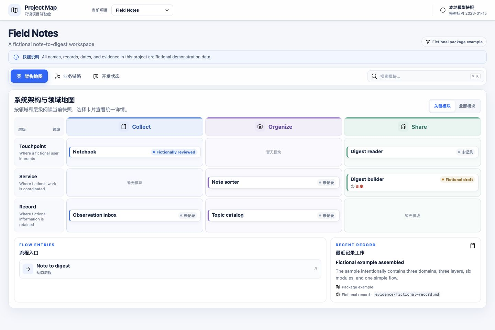

# Project Map

`project-map-kit` 把仓库中的 LikeC4 模型、项目配置、状态记录和可选 Mermaid 状态图构建成可离线浏览的静态 Project Map。构建和浏览过程不调用 LLM，不连接远程 API，也不会自动上传仓库或生成的网站。

仓库内附带两套完全虚构的示例：`Field Notes` 展示 3 个领域、3 个层级、6 个模块和 1 条流程；`Parcel Lab` 展示 2 个领域、2 个层级、5 个模块、2 条流程和 1 张 Mermaid 状态图。示例状态和证据均明确标记为虚构数据。



## 快速开始

需要 Node.js 22.22.3 或更高版本。在下载的仓库根目录安装锁定依赖并构建双项目演示：

```bash
npm ci
npm run browser:install
npm run build:demo
npm run preview
```

预览命令会启动本地静态服务器。终端会显示访问地址；默认端口由包脚本决定。

## 初始化独立模型

目标目录必须为空。`init` 会把 `examples/field-notes` 的完整内容复制进去，作为可直接修改的模板：

```bash
mkdir ../my-project-map
npm exec -- project-map init --dir ../my-project-map
npm exec -- project-map validate --root ../my-project-map
npm exec -- project-map build --root ../my-project-map --out dist/project-map
npm exec -- project-map serve --dir ../my-project-map/dist/project-map --port 5191
```

也可以跳过 npm 的 bin 解析，使用 `node bin/project-map.mjs` 加同样的参数。

## 接入外部仓库

先把本包作为外部仓库的开发依赖安装，再在外部仓库根目录放置 `project-map.json`。manifest 中的项目 JSON 路径相对 manifest 文件；项目配置中的模型、状态、证据和状态图路径相对该项目的 `project.json`。

```bash
npm install --save-dev ../project-map
npm exec -- project-map validate --root . --config project-map.json
npm exec -- project-map build --root . --config project-map.json --out dist/project-map
npm exec -- project-map serve --dir dist/project-map --port 5191
```

上面的安装路径按工具包实际位置调整。详细字段和路径规则见 [配置格式](docs/configuration.md)。可将完整的 `skills/project-map/` 文件夹复制到目标仓库的 `.agents/skills/project-map/`，或让 Agent 直接读取其中的 [SKILL.md](skills/project-map/SKILL.md)。

接入提示词示例：

> 使用 Project Map Skill 阅读当前项目的正式文档与相关代码，建立真实的领域、模块、关系和核心流程。复用工具包 UI，所有业务信息写入模型与配置；无法确认的内容标记 NEEDS_CONFIRMATION，缺少状态记录则保持未记录。保留来源，运行校验并构建本地预览，不修改业务代码、不发布站点。

运行 `npm test` 检查模型、CLI、路径边界、静态服务器与打包清单。当前验证范围见 [验证记录](docs/VALIDATION.md)。

## 命令

```text
project-map init --dir <emptyDir>
project-map validate --root <workspace> [--config project-map.json]
project-map build --root <workspace> [--config project-map.json] [--out dist/project-map]
project-map serve --dir <built> [--port 5191]
```

- `init` 只写入指定的空目录。
- `validate` 解析并检查输入，不生成静态站点。
- `build` 生成可离线托管的静态目录。
- `serve` 只服务已经构建的目录。

## 当前边界

- 配置文件当前只支持 JSON。
- LikeC4 动态视图只支持简单、线性的步骤列表；`parallel`、`loop` 等复杂 control block 尚不支持。
- Mermaid 只用于本地状态图源文件；含 Mermaid 状态图的 `validate` 和 `build` 使用本机 Chromium 完整渲染校验，先运行 `npm run browser:install`。
- 运行时没有 LLM、远程数据读取或自动仓库上传。
- 静态产物会包含项目名称、模块说明、流程文本、状态记录、证据路径以及 LikeC4 技术视图中的显式模型文本。构建成功不代表适合公开发布；发布前应由用户检查产物并明确选择发布范围。

本项目使用 MIT 许可证，见 [LICENSE](LICENSE)。直接依赖的许可说明见 [THIRD_PARTY_NOTICES.md](THIRD_PARTY_NOTICES.md)。
