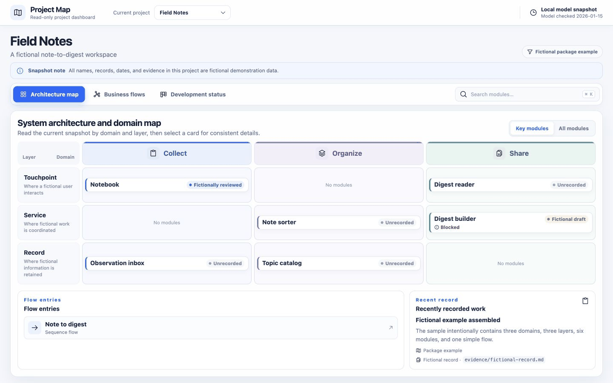

# Project Map

**English** · [简体中文](README.zh-CN.md)

`project-map-kit` turns LikeC4 models, project configuration, status records and optional Mermaid state diagrams into a static project map. Building and viewing the map make no LLM calls, use no remote data API, and never automatically upload your repository or generated site.

Two entirely fictional examples are included: **Field Notes** has 3 domains, 3 layers, 6 modules and 1 flow; **Parcel Lab** has 2 domains, 2 layers, 5 modules, 2 flows and 1 state diagram. Both have complete English and Chinese editions. All sample status records and evidence are explicitly fictional.



*Captured from the actual fictional example: overview → module details → business flow → development status. [Static overview](docs/images/overview-en.jpg).*

## Quick start

Requires Node.js 22.22.3 or later. From the downloaded repository:

```bash
npm ci
npm run browser:install
npm run build:demo
npm run preview
```

Open the edition you want:

- English: http://127.0.0.1:5191/?project=field-notes
- Chinese: http://127.0.0.1:5191/zh-CN/?project=field-notes

Each edition contains the same two fictional projects. `build:demo` builds English first, then Chinese. Rebuilding English alone replaces the whole output directory; run `npm run build:demo:zh` afterwards to restore the Chinese edition.

## Start your own model

The target must be new or empty. `init` copies the complete English Field Notes example:

```bash
npm exec -- project-map init --dir ../my-project-map
npm exec -- project-map validate --root ../my-project-map
npm exec -- project-map build --root ../my-project-map --out dist/project-map
npm exec -- project-map serve --dir ../my-project-map/dist/project-map --port 5191
```

For the Chinese starter, copy the contents of `examples/field-notes-zh/` into an empty directory, then use the same validation and build commands. You can also invoke the CLI directly with `node bin/project-map.mjs`.

## Use in another repository

Install this toolkit as a development dependency, then add a `project-map.json` manifest:

```bash
npm install --save-dev ../project-map
npm exec -- project-map validate --root . --config project-map.json
npm exec -- project-map build --root . --config project-map.json --out dist/project-map
npm exec -- project-map serve --dir dist/project-map --port 5191
```

Adjust the installation path to your downloaded toolkit. Manifest project paths are relative to the manifest; model, status, evidence and state diagram paths are relative to each `project.json`. See the [configuration reference](docs/configuration.md) (Chinese).

Copy the complete `skills/project-map/` directory into `.agents/skills/project-map/` in your target repository, or ask your agent to read its [SKILL.md](skills/project-map/SKILL.md). An example onboarding prompt:

> Use the Project Map Skill to read this project's authoritative documents and relevant code. Model its actual domains, modules, relationships and core flows. Reuse the toolkit UI and put all business information in configuration and models. Mark uncertain facts NEEDS_CONFIRMATION and leave missing status unrecorded. Preserve sources, validate and build a local preview. Do not change business code or publish the site.

Run `npm test` for model, CLI, path boundary, static server and package-content checks. See the [validation record](docs/VALIDATION.md) for tested scope and limitations.

## Commands

```text
project-map init --dir <emptyDir>
project-map validate --root <workspace> [--config project-map.json]
project-map build --root <workspace> [--config project-map.json] [--out dist/project-map]
project-map serve --dir <built> [--port 5191]
```

`init` writes only to an empty directory. `validate` checks inputs without producing a site. `build` generates a static directory. `serve` serves an already-built directory.

## Language and current limits

- Project `locale` supports `en` and `zh-CN`; omitting it preserves the original Chinese UI default. It controls generic UI copy, not automatic translation of business data.
- Write domain, module, flow, status, evidence and diagram labels in the selected language. Keep stable IDs and file paths unchanged. Chinese examples use `examples/project-map.zh-CN.json`.
- Configuration currently accepts JSON only.
- LikeC4 dynamic views support simple linear steps; complex control blocks such as `parallel` and `loop` are not supported.
- Mermaid `.mmd` validation and building require a local Chromium-compatible browser. Run `npm run browser:install` first.
- The upstream LikeC4 technical viewer retains its own built-in toolbar language. The screenshots show this toolkit's monolingual overview pages.
- Runtime has no LLM, remote data reads or automatic repository uploads.
- Static output includes your configured names, descriptions, status records, evidence paths and explicit model text in technical views. A successful build does not establish that the site is safe to publish. Review the output and choose its publication scope explicitly.

MIT licensed. See [LICENSE](LICENSE) and [third-party notices](THIRD_PARTY_NOTICES.md).
